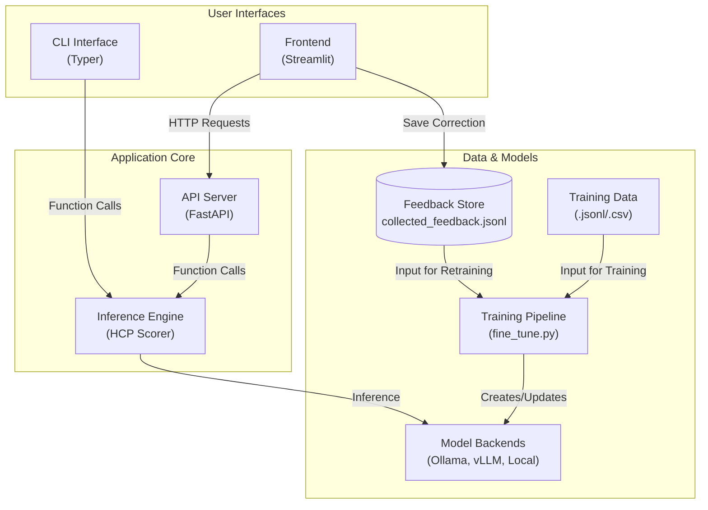

# HCP Rating System - Architecture Documentation

## Overview

The HCP Rating System is designed as a modular, scalable platform for evaluating Healthcare Providers based on telehealth session transcripts. The system supports multiple backend options and provides both web and API interfaces for easy integration.

## System Architecture



## Core Components

### 1. Frontend Layer
- **Technology**: Streamlit
- **Purpose**: Web-based user interface for transcript scoring
- **Features**:
  - Single transcript scoring
  - Batch processing
  - CSV upload and processing
  - Real-time visualizations
  - **Feedback collection for model improvement**
  - Export functionality

### 2. API Layer
- **Technology**: FastAPI
- **Purpose**: RESTful API for programmatic access
- **Endpoints**:
  - `/score` - Single transcript scoring
  - `/batch` - Batch transcript processing
  - `/upload-csv` - CSV file processing
  - `/health` - System health check

### 3. Inference Layer
- **Core Module**: `hcp_scorer.py`
- **Purpose**: Main scoring logic and model integration
- **Features**:
  - Multi-backend support
  - Automatic backend selection
  - Scoring result validation
  - Batch processing capabilities

### 4. Model Backend Layer
- **Ollama**: Local model inference (recommended)
- **vLLM**: High-performance inference server
- **Local**: Direct HuggingFace model loading
- **OpenAI**: Cloud-based API integration

## Data Flow

### Single Transcript Scoring
```
User Input → Frontend/API → HCP Scorer → Model Backend → Scoring Result → Response
```

### Batch Processing
```
CSV/JSON Input → Data Processor → HCP Scorer → Model Backend → Results → Report Generation
```

### Feedback & Retraining Loop
```
User Correction (UI) → Feedback Store (JSONL) → Training Pipeline → Fine-tuned Model
```

## Module Structure

### Frontend (`frontend/`)
```
frontend/
└── app.py              # Main Streamlit application
```

### API (`src/api/`)
```
src/api/
└── main.py             # FastAPI application and endpoints
```

### Inference (`src/inference/`)
```
src/inference/
├── __init__.py         # Package initialization
├── hcp_scorer.py       # Main scoring logic
├── ollama_client.py    # Ollama integration
└── local_model_scorer.py # Local model support
```

### Utilities (`src/utils/`)
```
src/utils/
├── __init__.py         # Package initialization
├── data_processor.py   # Data processing utilities
└── export_utils.py     # Export functionality
```

### CLI (`src/`)
```
src/
└── cli.py              # Command line interface
```

## Configuration Management

### Configuration Files
- **`configs/config.yaml`**: Main configuration file
- **`env.example`**: Environment variable template
- **`.env`**: Local environment variables (not in repo)

### Key Configuration Sections
```yaml
# Model configuration
model:
  name: "mistral-7b-instruct"
  temperature: 0.1
  max_length: 4096

# Ollama configuration
ollama:
  base_url: "http://localhost:11434"
  model_name: "mistral"

# Scoring configuration
scoring:
  dimensions:
    empathy:
      weight: 0.25
      description: "Shows understanding and compassion"
    clarity:
      weight: 0.25
      description: "Communicates clearly and effectively"
    accuracy:
      weight: 0.25
      description: "Provides accurate information and advice"
    professionalism:
      weight: 0.25
      description: "Maintains professional standards"
```

## Backend Selection Logic

The system automatically selects the best available backend:

1. **Ollama** (Priority 1): Local models with easy setup
2. **vLLM** (Priority 2): High-performance inference server
3. **Local** (Priority 3): Direct HuggingFace model loading
4. **OpenAI** (Priority 4): Cloud-based API (fallback)

## Data Processing Pipeline

### Input Processing
1. **Validation**: Check transcript format and content
2. **Cleaning**: Remove extra whitespace, normalize speaker labels
3. **Truncation**: Limit length if necessary
4. **Speaker Extraction**: Identify HCP and Patient turns

### Scoring Pipeline
1. **Prompt Creation**: Generate scoring prompt with criteria
2. **Model Inference**: Send to selected backend
3. **Response Parsing**: Extract JSON from model response
4. **Validation**: Verify scoring results
5. **Result Creation**: Generate ScoringResult object

### Output Processing
1. **Report Generation**: Create comprehensive reports
2. **Export**: Support for JSON, CSV, and text formats
3. **Visualization**: Charts and graphs for results

## Security Considerations

### API Security
- CORS configuration for web access
- Input validation and sanitization
- Rate limiting (future enhancement)
- Authentication (future enhancement)

### Data Privacy
- Local processing by default
- No data sent to external services (unless using OpenAI)
- Configurable data retention
- Export controls

## Scalability Features

### Horizontal Scaling
- Stateless API design
- Multiple API instances support
- Load balancer ready

### Vertical Scaling
- Configurable batch sizes
- Memory-efficient processing
- GPU acceleration support

### Performance Optimization
- Async processing for batch operations
- Caching for repeated requests
- Efficient data structures

## Monitoring and Logging

### Logging Configuration
```yaml
logging:
  level: "INFO"
  format: "%(asctime)s - %(name)s - %(levelname)s - %(message)s"
  file: "logs/hcp_rating.log"
```

### Health Checks
- API endpoint health monitoring
- Backend availability checks
- Model loading status
- System resource monitoring

## Deployment Options

### Local Development
- Direct Python execution
- Virtual environment isolation
- Hot reloading for development

### Docker Deployment
- Containerized application
- Multi-stage builds
- Environment variable configuration

### Cloud Deployment
- Kubernetes ready
- Auto-scaling support
- Load balancer integration

## Integration Points

### External Systems
- Telehealth platforms (future)
- Electronic health records (future)
- Learning management systems (future)

### Data Formats
- CSV import/export
- JSON API responses
- Standard data formats

### APIs
- RESTful API design
- OpenAPI specification
- Swagger documentation

## Testing Strategy

### Unit Tests
- **HCP Scorer Tests**: Core scoring logic
- **Data Processor Tests**: Data handling
- **API Tests**: Endpoint functionality

### Integration Tests
- Backend connectivity tests
- End-to-end workflow tests
- Performance benchmarks

### Test Coverage
- Core functionality: 90%+
- API endpoints: 85%+
- Data processing: 80%+

This architecture provides a robust, scalable foundation for HCP rating while maintaining simplicity for end users and flexibility for developers. 